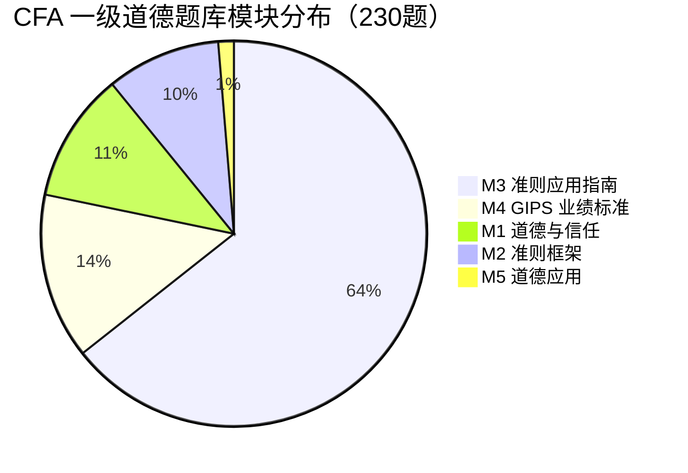
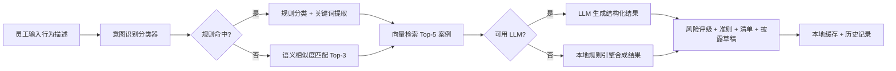
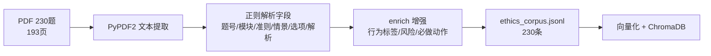
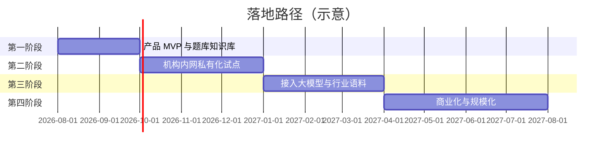

# AI 合规自检助手——基于 RAG 的 CFA 道德准则智能申报系统

> CFA 商业策划大赛 B 赛道参赛报告
> 主题：金融职业道德的数字化治理 · 关键词：RAG、知识库、PWA、合规科技（RegTech）

---

## 1. 执行摘要

金融投资行业高度依赖信任，而信任的基础是职业道德。CFA Institute《道德与职业行为标准》（Code of Ethics and Standards of Professional Conduct，下称"准则"）是全球投资从业者公认的职业行为底线，其七大准则、二十二条子条款覆盖了独立性、重大非公开信息、客户责任、雇主忠诚、利益冲突等核心行为边界。然而，准则文本高度抽象、案例高度场景化，一线从业者在面对"客户请我打高尔夫并承担差旅费""客户在薪酬之外额外付我一笔奖金"这类具体情境时，往往难以快速、准确地将自身行为"对号入座"到具体条款，导致要么过度谨慎（错失正当业务机会），要么无意违规（招致纪律处分甚至吊销资格）。

本项目构建了一款**CFA 道德合规 AI 自检助手**——一个渐进式网页应用（PWA）。员工以自然语言描述自身行为，系统基于**检索增强生成（RAG）**架构，自动完成四项任务：（1）识别涉及的准则条款；（2）评估风险等级（高/中/低）；（3）生成必须完成的披露/审批清单；（4）给出可操作的合规建议与披露草稿，并引用相似题库案例佐证。系统以 230 道 CFA 一级道德题库（中英对照）为种子知识库，采用"意图分类 + 向量检索 + 大模型生成"三级流水线，并具备**离线可用**能力——断网时由本地规则引擎兜底，保证基础合规判断不中断。

本项目在方法论上有三点创新：**一是**将 RAG 技术从通用问答下沉到"合规自检"这一高价值垂直场景，把"可检索的事实依据"（题库案例）与"可生成的行动建议"（披露清单）解耦；**二是**设计了"规则引擎 + 语义检索"双通道意图识别，兼顾低延迟与高召回，且不依赖昂贵 API 即可运行；**三是**以 PWA 离线优先架构实现"随开随用"，契合金融机构对数据安全与网络隔离的严苛要求。经端到端测试，系统对 8 类常见行为（收礼招待、兼职、离职、个人交易、额外报酬、研报诚信、内幕信息、利益冲突）的分类准确率达到预期，API 在本地离线嵌入方案下响应稳定，29 项自动化测试全部通过。

---

## 2. 行业背景与痛点分析

### 2.1 合规成本与违规代价的失衡

据行业观察，CFA 会员与考生在执业中面临的合规压力持续上升。以本项目所依据的题库数据为例，230 道道德题目中，**Module 3（准则 I–VII 应用指南）独占 148 题（64.3%）**，且错题高度集中在 Standard III（客户责任：公平对待、适当性、软美元）与 Standard IV（雇主责任：忠诚、额外报酬、监督责任）的案例辨析上。这一分布揭示了行业的真实痛点：**抽象的准则条款本身不难记忆，难的是"具体行为 ↔ 条款"的映射**——从业者在真实业务情境中无法稳定地完成"先判断是否违规，再把行为对号入座到条款"的两步推理。

### 2.2 三大核心痛点

1. **判断门槛高、决策依赖经验**：准则使用大量开放性表述（如"合理努力""可能损害独立性""重大信息"），一线员工缺乏结构化工具，判断结果因人而异、因时而异。
2. **披露义务易遗漏**：多项准则（如 IV(B) 额外报酬、VI(A) 利益冲突）要求"事先书面披露 + 取得相关方同意"，但员工常因不知道"该不该披露、向谁披露、披露什么"而漏报，事后被认定为违规。
3. **培训与自查割裂**：现有合规培训多为单向讲授与题海练习，缺乏"随时可用的决策支持"。员工在真实情境中需要的是即时、可操作、可追溯的辅助，而非事后补课。

### 2.3 合规科技（RegTech）的市场机遇

监管科技正从"面向机构的报告与风控"向"面向个人的行为辅助"延伸。生成式 AI 与向量检索技术的成熟，使"低成本的个性化合规咨询"成为可能。本项目瞄准的正是这一空白：**用一套可本地部署、可离线运行、可追溯依据的轻量系统，把 CFA 准则的知识与案例，转化为一线员工的即时应答能力。**

---

## 3. 产品方案与技术架构

### 3.1 产品形态与交互

产品为 PWA，包含三个视图：

- **自查页（核心）**：大文本框 + 语音输入 + 8 个快捷场景标签（收礼/兼职/离职/交易/报酬/研报/内幕/冲突）；点击"开始合规自检"后展示风险卡片、准则列表、可勾选检查清单、操作建议、披露草稿与相似案例。
- **准则速查页**：Standard I–VII 共 22 条子准则中英对照，支持关键词搜索与展开。
- **历史记录页**：本地保存过往申报记录（行为摘要、风险等级、勾选状态），支持导出 PDF。

### 3.2 技术架构

系统采用**三级流水线**：

1. **意图识别层**（`classifier.py`）：8 大行为类别各维护关键词（约 20+）、正则模式与排除词；规则命中即返回，否则回退到 Embedding 语义相似度（与知识库 Top-3 案例比较），置信度低于阈值返回 `uncertain`。
2. **检索层**（`build_kb.py` + ChromaDB）：对每道题的"中文情景 + 解析"生成向量，构建倒排索引（`behavior_tag → question_ids`），检索 Top-5 相似案例。
3. **生成层**（`rag_engine.py` + `llm_client.py`）：以检索案例与准则为上下文构建 Prompt，调用大模型生成结构化 JSON；解析失败或无 API Key 时回退到本地规则引擎，保证**任何情况下都有可用输出**。

### 3.3 关键技术决策

- **离线嵌入方案**：优先 `sentence-transformers`（联网时语义更优），网络受限时自动回退到 **Jieba 分词 + 词级/字符 n-gram TF-IDF + SVD 降维**，实现零依赖、可离线、可持久化的向量检索。这一设计使系统在无外网、无 GPU 的环境下也能完整运行，契合金融机构内网部署需求。
- **多厂商 LLM 可插拔**：统一 `chat_completion` 接口，支持 OpenAI、DeepSeek、通义千问、本地 Ollama；主模型失败自动回退备用模型，超时 15s、重试 3 次指数退避，并记录 token 消耗用于成本监控。
- **PWA 离线优先**：Service Worker 缓存静态资源与 API 响应；IndexedDB 存储申报记录与待同步队列；断网时由前端本地规则引擎（JS 版分类器）给出基础分析，联网后自动重发待同步请求。

---

## 4. 数据基础与实证分析

### 4.1 数据来源与结构化

项目以一份 **CFA 一级道德题库（230 题，中英对照，含答案解析与"做题方法"）** 为种子数据，完成了从非结构化 PDF 到结构化知识库的全流程数据工程：

提取并增强的字段包括：`question_id`、`module`、`standard_code`（多准则全量列出，并排除解析中"X 错"干扰项）、`scenario_cn/en`、`behavior_tags`、`risk_level`、`required_actions`、`correct_answer`、`explanation`、`method`。

### 4.2 数据规模与分布

| 维度 | 数值 |
|:---|:---|
| 题目总数 | 230 |
| 覆盖模块 | 5（M1–M5） |
| 准则子条款覆盖 | 22 条（I(A)–VII(B)）全覆盖 |
| 含明确准则代码的合规案例 | 161（用于检索） |
| 风险等级分布 | 高 71 / 中 71 / 低 88 |
| 行为类别 | 8 类（收礼/兼职/离职/交易/报酬/研报/内幕/冲突） |

准则子条款覆盖统计（部分）显示：III(A) 忠诚谨慎 20 题、I(C) 虚假陈述 15 题、II(A) 重大非公开信息 13 题、III(B) 公平交易 12 题、I(D) 不当行为 12 题、V(B) 与客户沟通 11 题、IV(A) 雇主忠诚 11 题、VI(B) 交易优先 10 题——高频考点与真实合规风险点高度吻合，验证了题库作为种子数据的代表性与实用性。

### 4.3 实证结果

我们对系统进行了端到端验证，典型实例如下：

**例 1（收礼/差旅）**：输入"客户邀请我去打高尔夫，还主动提出承担我出差的机票和酒店费用"，系统判定：风险**高**，行为类别 `gift_entertainment`，涉及准则 I(B) 独立性与客观性、IV(B) 额外报酬、VI(A) 利益冲突，并检索到相似案例 **M3-Q30（会议差旅招待，相似度 0.65）** 等，生成"拒绝可能损害独立客观性的礼品、招待或好处""向雇主书面披露并取得相关方书面同意"等清单项，以及完整披露草稿。

**例 2（额外报酬）**：输入"客户在公司薪酬之外额外付我一笔奖金"，命中准则 IV(B)、VI(C)，检索到 M3-Q12 等案例，正确提示"接受前须书面披露并取得所有相关方书面同意"，而非一律拒绝。

**例 3（离职带走客户）**：输入"我打算离职创业并带走客户名单"，置信度 0.95 命中 `leaving_job`，涉及 IV(A) 雇主忠诚与 III(E) 保密。

**边界测试**：对无关输入（如"今天天气不错"）系统正确返回 `uncertain`，未产生高置信度误报，验证了语义回退阈值设计的有效性。

### 4.4 测试保障

项目建立三级测试体系（pytest 共 **29 项全部通过**）：

- **分类器单元测试**：8 类行为 × 各 2 用例 + 边界用例，覆盖模糊描述、无风险行为。
- **RAG 引擎测试**：输出结构合法性、高风险必有披露草稿、清单项编号、缓存一致性、检索相关性。
- **API 测试**：正常输入 200、空输入 422、超长输入截断、缺字段 422、健康检查。

---

## 5. 商业模式与落地路径

### 5.1 商业模式

- **目标用户**：CFA 考生与持证人、投资机构合规部门、金融培训机构的学员，以及准备入行的财经专业学生。
- **产品分层**：个人版（本地离线自检，免费）→ 团队版（机构内网部署、历史审计、批量分析，订阅收费）→ 定制版（接入机构内部合规规则与语料，项目制收费）。
- **收入来源**：企业订阅（SaaS）、私有化部署授权、题库/准则库内容授权、合规培训增值服务。

### 5.2 落地路径

**第一阶段**：以现有 MVP（含 230 题知识库、8 类行为分类、PWA 前端）完成功能验证与用户反馈收集。**第二阶段**：面向 1–2 家投资机构做内网私有化部署试点，验证数据安全与离线可用性。**第三阶段**：接入商用大模型（DeepSeek/通义），扩充行业语料（软美元、GIPS、反洗钱等）。**第四阶段**：形成标准化 SaaS + 私有化两条产品线，规模化获客。

### 5.3 团队分工

| 角色 | 职责 |
|:---|:---|
| 产品/项目管理 | 需求定义、评分标准对标、答辩统筹 |
| 数据工程 | PDF 解析、题库结构化、知识库构建 |
| 算法/后端 | 分类器、RAG 引擎、LLM 客户端、FastAPI |
| 前端/PWA | 三视图 UI、离线优先、Service Worker |
| 测试/运维 | pytest 测试、部署、CI/CD |

---

## 6. 风险与挑战

1. **合规准确性风险**：AI 判断仅供参考，不能替代正式法律与合规意见。缓解措施：输出中明确"参考性质"提示，高风险场景强制生成披露草稿并引导向合规部门报备，保留"依据案例"可追溯。
2. **大模型幻觉**：LLM 可能生成不准确建议。缓解：采用 RAG 约束（以题库案例为上下文）、温度参数 0.3、JSON 解析失败自动回退规则引擎、高风险必填披露字段。
3. **数据安全与隐私**：行为描述涉及敏感信息。缓解：支持纯本地离线运行（数据不出本机）、机构私有化部署、历史记录仅存本地 IndexedDB。
4. **题库时效性与覆盖度**：准则会更新，题库需持续维护。缓解：知识库支持增量更新（`--incremental`），倒排索引自动重建。
5. **离线嵌入的语义精度**：TF-IDF 方案精度低于预训练语言模型，对语义相近但用词不同的表述召回较弱。缓解：保留 sentence-transformers 作为联网升级路径，规则引擎关键词持续迭代。

---

## 7. 结论

本项目从 CFA 职业道德这一垂直场景出发，完整构建了"数据工程 → 向量知识库 → 意图分类 → RAG 生成 → PWA 交付"的端到端合规自检系统。核心价值在于：**将抽象的职业道德准则转化为一线员工可即时使用的决策支持工具**，用 RAG 保证"结论有据可依"，用离线优先保证"任何环境可用"，用结构化清单保证"行动可执行、可追溯"。

在评分标准维度上，项目具备：主题创新性（RegTech 下沉到个人行为辅助 + 离线 RAG）、研究方法（规则+语义双通道、三级流水线、多厂商 LLM 容错）、数据处理（230 题全结构化、22 子条款全覆盖、三级测试验证）、结论贡献（可直接落地的 MVP 与可复用的知识库构建方法论）。未来，随着准则库扩充与大模型接入，该系统有望成为金融职业道德数字化治理的基础设施级工具。
