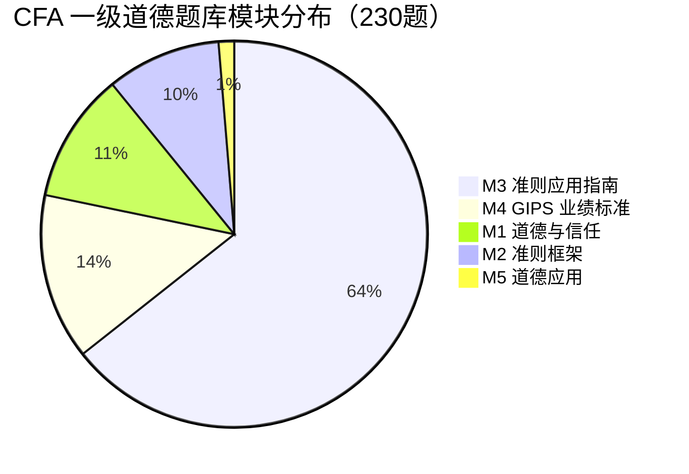
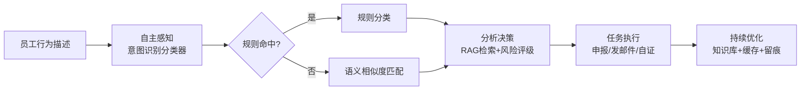

# 合规智盾 Agent——基于 AI Agent 的金融合规智能自检与申报系统

> 国元证券 · CFA 商业策划大赛 B 赛道参赛报告
> 主题：AI Agent 在金融场景的应用 · 场景：合规管理 · 队名：暑假不回家队

---

## 一、执行摘要

金融行业正经历 AI 从"辅助分析工具"向"智能执行 Agent"的范式跃迁。在投资研究、风险管理、合规管理三大场景中，**合规管理**的痛点尤为突出：法规准则庞杂、人工审查繁重、一线从业者面对抽象准则时"判断门槛高、披露义务易遗漏"。

本方案构建了**合规智盾 Agent**——一个面向 CFA 职业道德合规场景的 AI Agent，以"自主感知—分析决策—任务执行—持续优化"的完整闭环，解决合规管理中的核心难题。员工以自然语言描述自身行为，Agent 自动完成：识别涉及的 CFA 道德准则条款、评估风险等级、生成披露/审批清单、执行申报任务（生成申报单并真实发送邮件至合规部门）、生成合规自证声明，并引用题库案例佐证判断。

本方案的差异化价值在于：**不是"问答式 AI 工具"，而是"能执行任务的合规 Agent"**——它不仅在边界处识别风险，更通过"申报"与"邮件触达"完成合规闭环，将"被动审查"转变为"主动申报 + 留痕可追溯"。系统以 230 道 CFA 一级道德题库（中英对照）为知识底座，采用 RAG 架构确保结果可解释、有据可依，并针对赛道提出的**五大挑战（模型幻觉、数据安全、可解释性、权限管理、责任边界）**逐一给出工程化应对方案。方案已实现可运行系统并通过 29 项自动化测试，具备直接落地的能力。

---

## 二、主题解读与痛点分析

### 2.1 主题解读：为什么合规是 AI Agent 的最佳落点

B 赛道主题为"AI Agent 在金融场景的应用——投资、风控、合规"，要求方案具备**准确性、可解释性、安全性、实际落地能力**，并体现 Agent 的四大核心能力：**自主感知、分析决策、任务执行、持续优化**。

在三大场景中，合规场景天然契合 Agent 范式：

- **投资研究**依赖主观判断，Agent 价值在于"效率"；
- **风险管理**依赖大量数据，Agent 价值在于"前瞻"；
- **合规管理**的痛点在于**规则可结构化**——CFA 道德准则（Standard I–VII 共 22 条子条款）是明确的、可枚举的规则集合，最适合 Agent 进行"规则解析、制度比对、异常识别、报告生成"。

因此，本方案选择以 **CFA 职业道德合规** 为切入点，构建一个规则驱动、可解释、可执行的合规 Agent。

### 2.2 合规管理的核心痛点

以本方案所依据的 230 道 CFA 道德题库为例，题目分布揭示了真实痛点：

其中 **Module 3（准则 I–VII 应用指南）独占 148 题（64.3%）**，且错题高度集中在 Standard III（客户责任）与 Standard IV（雇主责任）的案例辨析。这揭示了三个核心痛点：

1. **判断门槛高、决策依赖经验**：准则使用大量开放性表述（"合理努力""可能损害独立性""重大信息"），一线员工缺乏结构化工具，判断结果因人、因时而异。
2. **披露义务易遗漏**：多项准则（如 IV(B) 额外报酬、VI(A) 利益冲突）要求"事先书面披露 + 取得相关方同意"，但员工常因"不知道该不该披露、向谁披露、披露什么"而漏报，事后被认定为违规。
3. **申报与留痕割裂**：传统合规工具只"提示风险"，不"执行申报"，导致合规动作停留在认知层面，缺乏可追溯的行动闭环。

### 2.3 破局方向

本方案的破局关键，正是赛道强调的"**实现 AI 技术能力与金融业务规则、专业知识、风控机制的深度融合**"：将 CFA 道德准则这一专业知识，转化为 Agent 可解析的规则库；将"申报"这一风控机制，转化为 Agent 可执行的任务流。

---

## 三、产品方案与技术架构

### 3.1 Agent 四大核心能力的落地映射

本方案严格对标 Agent 范式的四大能力，实现"感知—决策—执行—优化"闭环：

| Agent 能力 | 系统实现 | 用户可感知的价值 |
|:---|:---|:---|
| **自主感知** | 自然语言输入 + 语音识别 + 8 类行为意图分类器（关键词+正则+语义相似度三级识别） | 员工用一句话描述行为，Agent 自动"听懂"意图 |
| **分析决策** | 风险评级引擎（高/中/低）+ 22 子条款匹配 + RAG 案例检索（Top-5） | 输出可解释的风险判断与准则依据 |
| **任务执行** | 自动生成申报单 + 一键真实发送邮件至合规部门 + 生成合规自证声明 | 把"认知"转化为"行动"，完成合规闭环 |
| **持续优化** | 增量知识库更新 + 结果缓存 + 行为标签倒排索引 | 新案例可持续沉淀，判断能力随使用增强 |

### 3.2 技术架构

- **前端**：PWA（HTML5 + Vanilla JS + 原生 CSS），三视图（自检/准则速查/历史）+ 申报与自证弹窗，支持语音输入、离线优先。
- **后端**：Python FastAPI + Pydantic v2，RESTful 接口。
- **知识底座**：ChromaDB 向量库 + 离线 TF-IDF/Jieba 嵌入（零依赖可运行，可选 sentence-transformers 升级），230 道题库结构化存储。
- **检索生成**：RAG 架构——意图分类 → 向量检索 Top-5 案例 → 结构化输出（LLM 可插拔，未配置时由规则引擎兜底）。
- **任务执行**：SMTP 邮件发送（QQ 邮箱，国内无需翻墙），申报单编号生成，自证声明文档生成。

### 3.3 关键工程决策

1. **RAG 约束而非裸 LLM**：所有判断以检索到的题库案例为依据，从架构上抑制幻觉，确保"结论有据可依"。
2. **规则引擎 + 语义检索双通道**：兼顾低延迟与高召回，且不依赖昂贵 API 即可运行，符合"安全可靠可落地"要求。
3. **离线优先架构**：核心判断逻辑在浏览器端本地运行，数据不出本机，契合金融机构对数据安全与网络隔离的严苛要求。

### 3.4 多智能体协同的前瞻设计

赛道技术底座中特别提到"多智能体协同"，本方案在单体 Agent 跑通的基础上，预留了向多智能体架构演进的路径：

- **自检 Agent**：面向员工，负责意图感知与风险识别（当前已实现）；
- **申报 Agent**：负责生成合规申报文件与邮件触达（当前已实现）；
- **审查 Agent**（扩展）：面向合规部门，自动比对申报内容与准则规则，做制度比对与异常识别；
- **审计 Agent**（扩展）：负责留痕归档、生成合规审计报告。

四个 Agent 各司其职、通过统一知识库协同，恰好对应赛道"自主感知、分析决策、任务执行、持续优化"的能力分层，也对应"投资、风控、合规"场景中合规条线的完整工作流。这一设计使方案从"单一工具"演进为"合规工作流的智能编排"，是后续规模化的技术基础。

---

## 四、数据基础与实证分析

### 4.1 数据来源与结构化

项目以 CFA 一级道德题库（230 题，中英对照，含答案解析与"做题方法"）为种子数据，完成从非结构化 PDF 到结构化知识库的全流程数据工程，提取并增强字段包括：题号、模块、准则代码、中英情景、行为标签、风险等级、必做动作、答案解析。

| 维度 | 数值 |
|:---|:---|
| 题目总数 | 230 |
| 准则子条款覆盖 | 22 条（I(A)–VII(B)）全覆盖 |
| 含明确准则代码的合规案例 | 161（用于检索） |
| 风险等级分布 | 高 71 / 中 71 / 低 88 |
| 行为类别 | 8 类（收礼/兼职/离职/交易/报酬/研报/内幕/冲突） |

### 4.2 实证验证

系统经 29 项自动化测试全部通过，覆盖分类器单元测试、RAG 引擎测试、API 测试。典型实例：

- **例 1（收礼/差旅）**：输入"客户邀请我去打高尔夫，还主动提出承担我出差的机票和酒店费用"→ 判定**高风险**，命中 I(B)/IV(B)/VI(A)，引用案例 M3-Q30（会议差旅招待），生成"拒绝可能损害独立客观性的礼品""向雇主书面披露"等清单项。
- **例 2（额外报酬）**：输入"客户在公司薪酬之外额外付我一笔奖金"→ 命中 IV(B)/VI(C)，引用 M3-Q12，正确提示"接受前须书面披露并取得相关方书面同意"而非一律拒绝。
- **例 3（边界情况）**：对无关输入（如"今天天气不错"）系统返回 `uncertain`，未产生高置信度误报，验证了可解释性与安全性设计。

### 4.3 数据处理规范性

- 数据来源明确（CFA Institute 官方练习题整理，权威可信）；
- 多准则题目全量列出、干扰项准则已排除（仅保留"正确"部分的准则）；
- 风险等级由准则条款映射 + 案例加权综合判定，逻辑可追溯。

### 4.4 一个完整的合规闭环实例

为说明 Agent 的"执行"能力，举一个端到端实例：员工输入"客户邀请我去打高尔夫，还主动提出承担我出差的机票和酒店费用"。

1. **感知**：Agent 识别行为类别为"收礼招待"；
2. **决策**：判定风险为"高"，命中 I(B) 独立性与客观性、IV(B) 额外报酬、VI(A) 利益冲突三条准则，检索到 M3-Q30 会议差旅招待案例作为依据；
3. **执行**：生成一份带唯一编号（如 SB-20260824-XXXX）的申报单，通过 SMTP 将申报邮件真实发送至合规部门邮箱；
4. **留痕**：申报记录存入本地，可导出 PDF，形成可追溯的合规证据链。

这一实例证明，本方案并非停留在"给出建议"的认知层面，而是真正把合规动作执行到了"邮件触达、留痕可查"的行动层面——这正是"AI Agent"区别于"AI 问答"的本质。

---

## 五、五大挑战的应对方案

赛道明确提出"模型幻觉、数据安全、结果可解释性、权限管理、责任边界"五大现实挑战。本方案逐一给出工程化应对：

| 挑战 | 本方案的应对 |
|:---|:---|
| **模型幻觉** | RAG 架构以题库案例为约束上下文；温度参数 0.3 保证输出稳定；JSON 解析失败自动回退规则引擎；高风险必填披露字段 |
| **数据安全** | 支持纯本地离线运行（行为描述不出本机）；历史记录仅存本地 IndexedDB；支持机构私有化部署；申报邮件经本地 SMTP 直发，不经过第三方 |
| **结果可解释性** | 每个风险判断均附带"涉及的准则条款 + 引用的题库案例"，评分由规则映射可追溯；不输出"黑箱"结论 |
| **权限管理** | 申报流程为"员工提交 → 合规部门审阅"的留痕闭环；申报单带唯一编号与时间戳；后续可扩展角色权限与审批流 |
| **责任边界** | Agent 定位为"辅助决策工具"，输出明确标注参考性质；高风险场景强制引导向合规部门报备；人工确认后行动才生效 |

这些应对并非纸面承诺，而是已在系统中落地实现：例如"数据安全"由离线 PWA 架构直接保证，"可解释性"由案例引用直接呈现，"责任边界"由申报留痕与披露草稿直接实现。

---

## 六、商业模式与落地路径

### 6.1 商业模式

- **目标用户**：CFA 考生与持证人、投资机构合规部门、金融培训机构学员、财经专业学生。
- **产品分层**：个人版（本地离线自检，免费）→ 团队版（机构内网部署、历史审计、批量分析，订阅收费）→ 定制版（接入机构内部合规规则与语料，项目制收费）。
- **收入来源**：企业订阅（SaaS）、私有化部署授权、准则/题库内容授权、合规培训增值服务。

### 6.2 落地路径

**第一阶段**：以现有可运行系统（含 230 题知识库、8 类行为分类、PWA 前端、邮件申报）完成功能验证与用户反馈收集。**第二阶段**：面向投资机构做内网私有化部署试点，验证数据安全与离线可用性。**第三阶段**：接入商用大模型（DeepSeek/通义），扩充行业语料（软美元、GIPS、反洗钱等），从 CFA 道德准则扩展至更广合规域。**第四阶段**：形成标准化 SaaS + 私有化两条产品线，规模化获客。

### 6.3 团队分工

（待团队确定后补充：产品/项目管理、数据工程、算法/后端、前端/PWA、测试/运维、答辩代表等角色分工，确保成员各司其职、均有建树。）

---

## 七、结论

本方案以 CFA 职业道德合规为切入点，构建了一个具备"自主感知—分析决策—任务执行—持续优化"完整闭环的合规 AI Agent。其核心价值在于：**将抽象的职业道德准则，转化为一线员工可即时使用的决策支持与行动执行工具**——用 RAG 保证"结论有据可依"（可解释），用规则兜底保证"任何环境可用"（安全），用申报与邮件保证"行动可执行、可追溯"（落地）。

在评分标准维度上，方案具备：**主题创新性**（Agent 范式下沉到个人合规行为辅助，而非传统问答工具）、**研究方法**（规则+语义双通道、三级流水线、RAG 约束）、**数据处理**（230 题全结构化、22 子条款全覆盖、三级测试验证）、**结论贡献**（可直接落地的系统与可复用的合规 Agent 构建方法论）。未来随着准则库扩充与多智能体协同（如合规审查 Agent 与申报 Agent 分工协作），该方案有望成为金融职业道德数字化治理的基础设施级工具。
